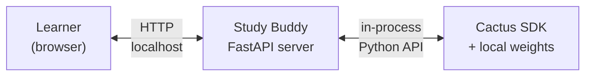
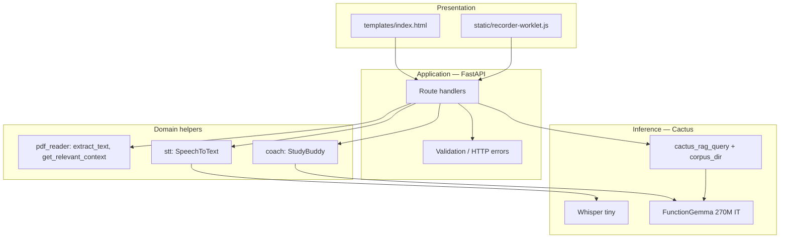
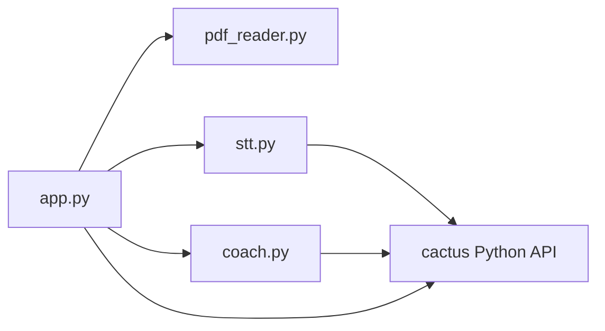
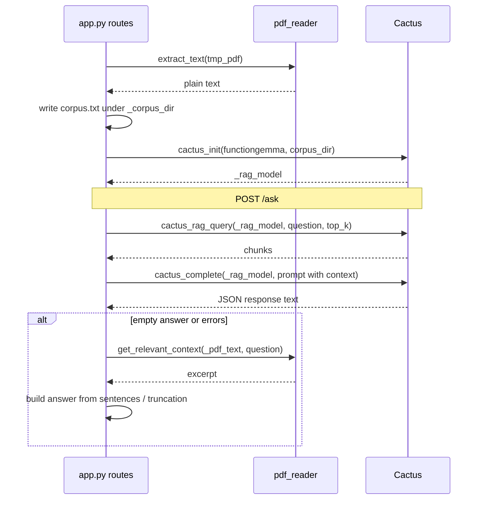

# Study Buddy — Architecture

This document describes how the Study Buddy service is structured: layers, modules, runtime state, and how local inference (Cactus) fits in.

For setup and API examples, see [README.md](README.md).

---

## 1. System context

Study Buddy is a **single-process Python server** (FastAPI + Uvicorn) that:

- Serves a **static HTML UI** and **static assets** to the browser.
- Accepts **PDFs**, **audio**, and **JSON** over HTTP.
- Runs **Whisper** (speech-to-text) and **FunctionGemma** (text generation and tool-style scoring) **only through the local Cactus SDK**—no remote LLM API in this codebase.

**External dependency:** a sibling **`cactus`** repository on disk (same parent directory as this project). Paths resolve as `<repo-root>/../cactus`.

The browser talks only to Study Buddy; the server talks only to the local Cactus installation (no remote LLM in this application).

*High-level flow diagram (same asset as in [README.md](README.md) Architecture).*

---

## 2. Layered view

| Layer | Responsibility |
|-------|----------------|
| **Presentation** | UI, recording, `fetch` to REST endpoints. No business logic beyond client validation. |
| **Application** | HTTP mapping, multipart/file handling, global orchestration of PDF lifecycle and RAG model handle. |
| **Domain** | PDF text extraction, keyword context snippets, STT wrapper, structured feedback via FunctionGemma tools. |
| **Inference** | Model weights and Cactus APIs (`cactus_init`, `cactus_complete`, `cactus_transcribe`, `cactus_rag_query`, `cactus_destroy`). |

---

## 3. Module map and dependencies

| Module | Role |
|--------|------|
| **`app.py`** | FastAPI app, CORS, static mount, route definitions, **in-process global state** for PDF text and RAG model handle, orchestrates upload → corpus → `cactus_init`, `/ask`, `/quiz`, `/feedback`, `/transcribe`. |
| **`pdf_reader.py`** | `extract_text(path)` for PDFs; `get_relevant_context(full_text, query)` for keyword-style passages when RAG or LLM output is missing. |
| **`stt.py`** | `SpeechToText`: loads Whisper via Cactus, transcribes files from disk paths produced by upload handlers. |
| **`coach.py`** | `StudyBuddy`: FunctionGemma with a single tool schema for score + bullet feedback; uses optional `pdf_context` string from `get_relevant_context`. |

---

## 4. Runtime state (server process)

The following globals in **`app.py`** define server-side session semantics (single user / single document per process—no multi-tenant isolation):

| Symbol | Meaning |
|--------|---------|
| `_pdf_text` | Full extracted text of the last successfully uploaded PDF. |
| `_pdf_name` | Original filename for health reporting. |
| `_rag_model` | Cactus model handle for FunctionGemma initialised **with** `corpus_dir` (RAG index over `corpus.txt`). |
| `_corpus_dir` | Temporary directory containing `corpus.txt`; reused across uploads until replaced. |

**Lifecycle:**

- **New PDF upload:** previous `_rag_model` is destroyed with `cactus_destroy`; corpus directory is reused or created; fresh `corpus.txt` is written; `_rag_model = cactus_init(LLM_PATH, corpus_dir=..., cache_index=False)`.
- **Process exit:** OS reclaims temp dirs; explicit teardown of models is not guaranteed on SIGKILL (normal shutdown depends on Uvicorn).

---

## 5. Inference pipelines

### 5.1 Study mode (`POST /upload-pdf`, `POST /ask`)

### 5.2 Practice scoring (`POST /feedback`)

Handled in **`coach.py`**: each `get_feedback` call runs **`cactus_init`** without `corpus_dir`, performs **`cactus_complete`** with `force_tools=True` and the `give_feedback` tool schema, then **`cactus_destroy`** in a `finally` block. This is **independent** of the RAG-backed FunctionGemma handle in `app.py` (study mode uses a long-lived model with `corpus_dir`).

The route may attach a short **PDF excerpt** via `get_relevant_context` when a document is loaded and a question or transcript is available.

### 5.3 Speech (`POST /transcribe`)

Whisper is **not** shared with the RAG FunctionGemma handle. Each `transcribe()` call in `stt.py` runs **`cactus_init` → `cactus_transcribe` → `cactus_destroy`** on the Whisper weights path.

---

## 6. HTTP surface (routing map)

| Endpoint | Handler concern |
|----------|-----------------|
| `GET /` | Read `templates/index.html` into response body. |
| `GET /static/*` | Static file mount for worklet and future assets. |
| `GET /health` | Aggregate flags: STT availability, PDF loaded, RAG handle ready. |
| `POST /upload-pdf` | Validate PDF, extract, rebuild corpus, re-init RAG model. |
| `POST /ask` | Greeting heuristics, RAG + LLM or fallback excerpt answer. |
| `POST /quiz` | Sample sentence-style practice prompt from PDF text. |
| `POST /feedback` | Build optional context; delegate to `StudyBuddy.get_feedback`. |
| `POST /transcribe` | Save upload to temp file; call `SpeechToText`; cleanup. |

---

## 7. Operational constraints

- **Concurrency:** Global PDF/RAG state is not guarded for concurrent multi-user writes; suitable for single-user / local dev. Scaling would require session or tenant scoping and model pooling.
- **Disk:** Temp PDFs are deleted after extraction; corpus persists in `_corpus_dir` until process end or next upload.
- **Cactus layout:** Moving the `cactus` checkout requires updating `CACTUS_REPO` resolution in `app.py`, `stt.py`, `coach.py`, and `run.sh`.

---

## 8. Extension points

| Goal | Likely touch points |
|------|---------------------|
| Multi-user / sessions | Replace globals with session store; per-session `_rag_model` or shared index + locking. |
| New document types | Extend `pdf_reader` or add parsers; keep corpus format compatible with `cactus_init`. |
| Different models | Change weight paths (`LLM_PATH`, Whisper id in `stt.py`). |
| Automated tests | Mock Cactus at the Python boundary or use integration tests with real weights in CI. |

---

## Document history

Architecture reflects the codebase layout at the repository root (flat layout: `app.py`, `stt.py`, `coach.py`, `pdf_reader.py` alongside `templates/` and `static/`).
