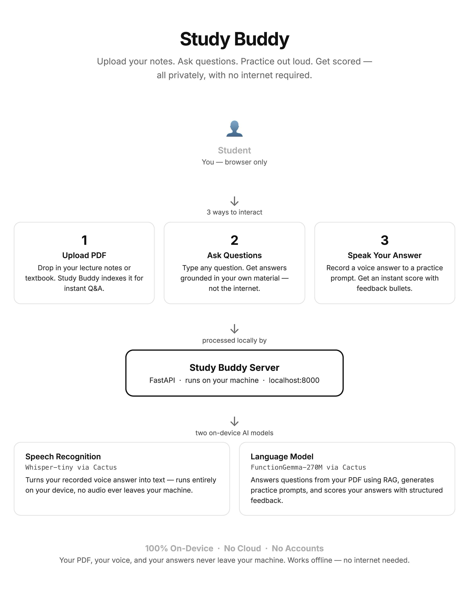
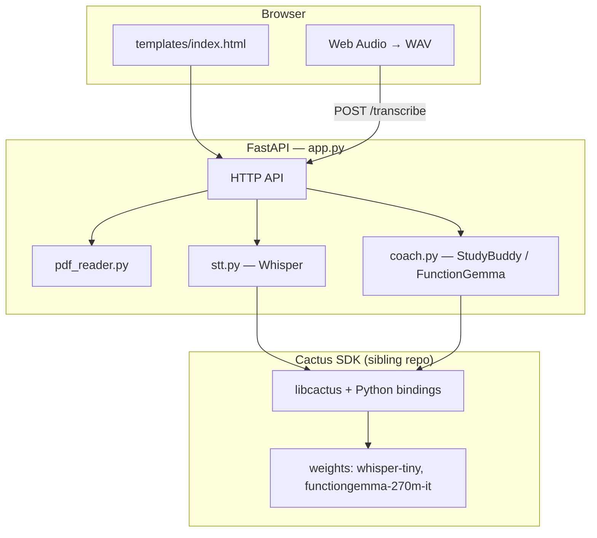
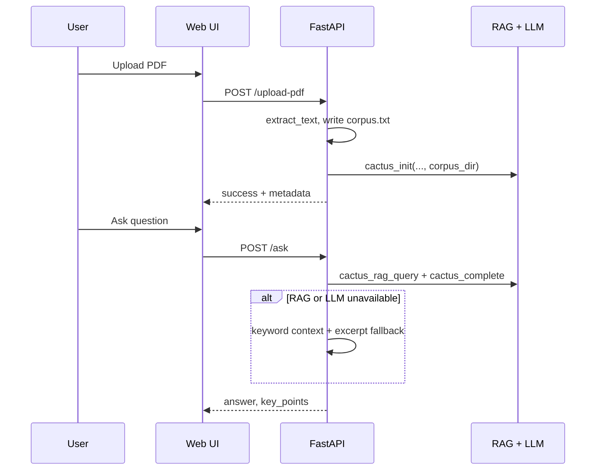
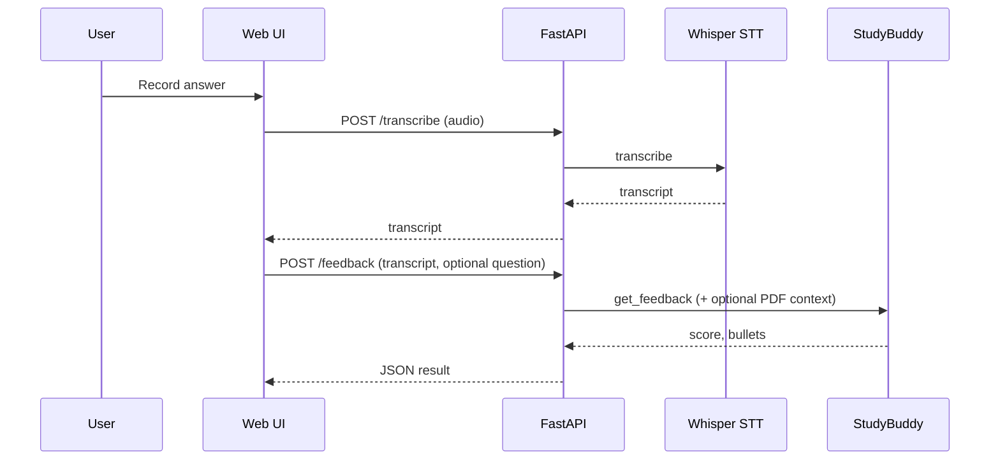
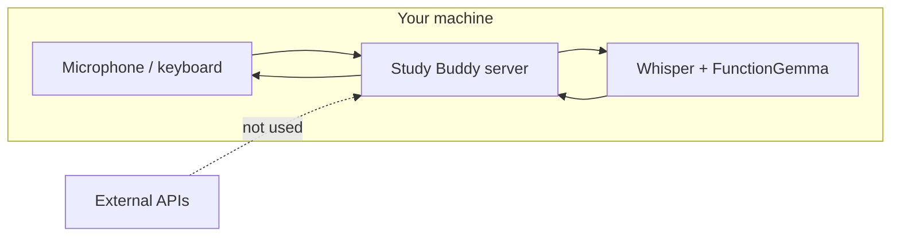
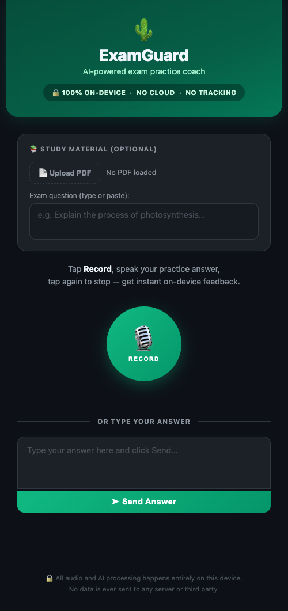

# Study Buddy



On-device exam study and practice assistant. Upload a PDF, ask questions grounded in your material, generate practice prompts, and get scored feedback on spoken or typed answers. Inference runs locally via the **Cactus** SDK (native bindings and model weights in your local `cactus` checkout)—no cloud LLM calls and no accounts required.

---

## Table of contents

- [Features](#features)
- [Architecture](#architecture) · [ARCHITECTURE.md](ARCHITECTURE.md)
- [User flows](#user-flows)
- [Requirements](#requirements)
- [Installation](#installation)
- [Running the application](#running-the-application)
- [Project layout](#project-layout)
- [API reference](#api-reference)
- [Frontend](#frontend)
- [Screenshots](#screenshots)
- [Privacy](#privacy)
- [Troubleshooting](#troubleshooting)

---

## Features

| Capability | Description |
|------------|-------------|
| **Study mode** | Upload a PDF; answers use RAG (`cactus_rag_query`) over the corpus, with FunctionGemma generating responses from retrieved context. |
| **Q&A** | `POST /ask` answers questions using indexed material, with keyword fallback if RAG is unavailable. |
| **Practice** | `POST /quiz` suggests explain-in-your-own-words prompts from the document. |
| **Voice input** | Browser-captured audio → Whisper-tiny (`cactus_transcribe`) → transcript. |
| **Feedback** | `POST /feedback` returns structured score and bullet suggestions via FunctionGemma tool calling; optional PDF context when a document is loaded. |

---

## Architecture

The backend is a **FastAPI** application. **FunctionGemma** and **Whisper** are loaded through Cactus native bindings. The UI is server-rendered HTML with static assets and client-side recording (Web Audio → WAV).



**Cactus path:** the app expects a **`cactus`** directory next to this repository (same parent folder). `run.sh` and `app.py` / `stt.py` / `coach.py` resolve `../cactus` from the project root.

For layers, module boundaries, runtime state, and extension points, see **[ARCHITECTURE.md](ARCHITECTURE.md)**.

---

## User flows

### Study: upload PDF and ask questions



### Practice: voice answer and feedback



### End-to-end data path (privacy)



---

## Requirements

- **Python** 3.10+ recommended (3.12 tested).
- **Cactus** cloned and built next to this repo, e.g.  
  `PycharmProjects/cactus` alongside `PycharmProjects/Study Buddy-Cactus-hackathon` (use quotes in shell paths because of the space).
- **Models** (first run): Whisper tiny and FunctionGemma weights under the Cactus `weights/` tree (`run.sh` can trigger Whisper download).

---

## Installation

**1. Cactus environment and Whisper model** (from your Cactus checkout):

```bash
cd /path/to/cactus
source ./setup
cactus download openai/whisper-tiny
```

Use your Hugging Face token if the CLI requires it.

**2. Python dependencies** (from this repository root):

```bash
cd "/path/to/Study Buddy-Cactus-hackathon"
pip install -r requirements.txt
```

**3. Environment variables (optional)**

- Copy the template and keep real values only in `.env` (gitignored):

```bash
cp .env.example .env
```

- `HF_TOKEN` — set if Hugging Face asks for authentication when downloading models (`run.sh` loads `.env` before `cactus download`).
- `GEMINI_API_KEY` — not used by the current on-device Study Buddy stack; reserved if you add optional cloud features.

`app.py` loads `.env` via `python-dotenv` on startup. Do not commit `.env` or paste keys into tracked files.

---

## Running the application

From the repository root:

```bash
./run.sh
```

Or directly:

```bash
python app.py
```

The server listens on **http://localhost:8000** (bind `0.0.0.0:8000`).

---

## Project layout

```
.
├── app.py              # FastAPI app, routes, RAG lifecycle
├── coach.py            # StudyBuddy — FunctionGemma scoring / tool calls
├── stt.py              # Whisper speech-to-text wrapper
├── pdf_reader.py       # PDF extraction and keyword context
├── requirements.txt
├── run.sh              # Optional bootstrap: venv from Cactus, deps, server
├── templates/
│   └── index.html      # Main UI
├── static/
│   └── recorder-worklet.js
├── flow_diagram.jpg    # High-level architecture / flow (see Architecture)
├── screenshots/        # UI captures for docs (see Screenshots below)
│   ├── initial.png
│   ├── results.png
│   └── full_results.png
├── README.md
└── ARCHITECTURE.md     # Layers, state, inference pipelines
```

---

## API reference

| Method | Path | Purpose |
|--------|------|---------|
| `GET` | `/` | Serves the web UI |
| `GET` | `/health` | Liveness and model/PDF state |
| `POST` | `/upload-pdf` | Accepts `pdf` file field; builds corpus and RAG index |
| `POST` | `/ask` | JSON `{ "question": "..." }` — study Q&A from material |
| `POST` | `/quiz` | JSON `{ "topic": "" }` optional — practice prompt from PDF |
| `POST` | `/transcribe` | Multipart `audio` — WAV/WebM/M4A-style uploads |
| `POST` | `/feedback` | JSON `{ "transcript": "...", "question": "" }` — score + bullets |

### Examples

**Health**

```bash
curl -s http://localhost:8000/health | jq
```

Example shape:

```json
{
  "status": "ok",
  "stt_ready": true,
  "pdf_loaded": true,
  "pdf_name": "notes.pdf",
  "rag_ready": true,
  "on_device": true
}
```

**Transcribe**

```bash
curl -s -X POST http://localhost:8000/transcribe \
  -F "audio=@recording.wav"
```

**Feedback** (optional `question` improves PDF context selection)

```bash
curl -s -X POST http://localhost:8000/feedback \
  -H "Content-Type: application/json" \
  -d '{"transcript": "Your answer text...", "question": "Exam question if any"}'
```

**Ask** (after PDF upload)

```bash
curl -s -X POST http://localhost:8000/ask \
  -H "Content-Type: application/json" \
  -d '{"question": "What is the main idea of chapter 2?"}'
```

### Component-level checks

```bash
python stt.py    # Smoke-test Whisper transcription standalone
```

---

## Frontend

- **Templates:** Jinja-ready static HTML in `templates/index.html` (served as raw HTML by FastAPI).
- **Assets:** `static/recorder-worklet.js` for capture pipeline.
- **API usage:** `fetch` to `/transcribe` (multipart) and `/feedback` (JSON), plus PDF upload and study-mode endpoints as implemented in the template.

Customize styling via CSS in the template; audio is encoded as WAV in the browser without requiring ffmpeg on the client.

---

## Screenshots

Static **UI captures for documentation** live under [`screenshots/`](screenshots/). Add or replace PNGs there when you refresh marketing or README visuals. Files named `screenshot_*.png` in the **repository root** remain ignored (e.g. ad-hoc automation dumps); curated images belong in `screenshots/` so they can be versioned.

| File | Description |
|------|-------------|
| [`screenshots/initial.png`](screenshots/initial.png) | Main view after load |
| [`screenshots/results.png`](screenshots/results.png) | Results / feedback state |
| [`screenshots/full_results.png`](screenshots/full_results.png) | Taller capture showing full results area |




---

## Privacy

| Topic | Behavior |
|-------|----------|
| Audio | Processed on device through the local server; not sent to third-party APIs by this app. |
| Transcripts & PDF text | Stay on your machine unless you export or copy them elsewhere. |
| Authentication | None; no user accounts in this codebase. |
| Outbound calls | Backend is designed for offline inference; behavior depends on your Cactus build and system configuration. |

---

## Troubleshooting

| Issue | What to check |
|-------|----------------|
| `Whisper model not loaded` / STT errors | Run `cactus download openai/whisper-tiny` in Cactus; confirm `weights/whisper-tiny` exists. |
| RAG never ready | Confirm `POST /upload-pdf` succeeds; watch server logs for `[RAG]` messages. |
| Import / `cactus` not found | Ensure `cactus` is a **sibling** of this repo and `cactus/python/src` is on `PYTHONPATH` (handled in `app.py` when paths match). |
| `run.sh` fails on Cactus path | Edit `CACTUS_DIR` in `run.sh` if your Cactus checkout lives elsewhere. |

---

## Contributing

1. Fork the repository and create a branch for your change.
2. Keep commits focused; match existing code style.
3. Test PDF upload, `/ask`, `/transcribe`, and `/feedback` manually after substantive backend changes.
4. Open a pull request with a short description of behavior changes and any new dependencies.

---

## Acknowledgments

Built with the Cactus SDK for on-device Whisper and FunctionGemma inference.
